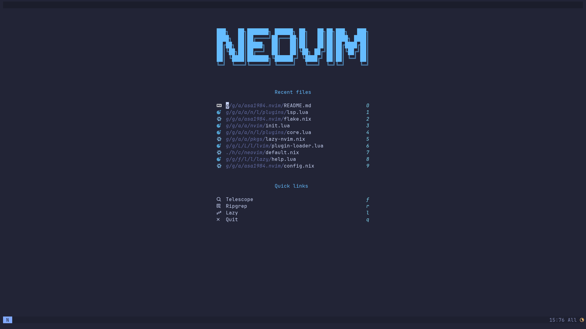

# :zap: asa1984.nvim

My personal Neovim configuration.

Run the following command:

```bash
nix run github:asa1984/asa1984.nvim
```

then, Neovim starts with pre-configured settings!



## :rocket: Features

- Pre-configured settings
- Pre-installed plugins & development tools with [Nix](https://nixos.org/)
- Lazy loading with [lazy.nvim](https://github.com/folke/lazy.nvim) (Startup time is less than **20ms**)

## :package: Packages

| Name           | Description                                     |
| -------------- | ----------------------------------------------- |
| neovim-full    | Neovim with all development tools               |
| neovim-light   | Neovim with development tools that I mainly use |
| neovim-minimal | Neovim without any development tools            |
| config         | Only the configuration files                    |

## :book: References

- [一般構築魔法(Nix)のVimへの応用について](https://zenn.dev/natsukium/articles/b4899d7b1e6a9a)
- [natsukium/dotfiles](https://github.com/natsukium/dotfiles)
- [Nixpkgs 23.11 manual](https://nixos.org/manual/nixpkgs/stable/)
